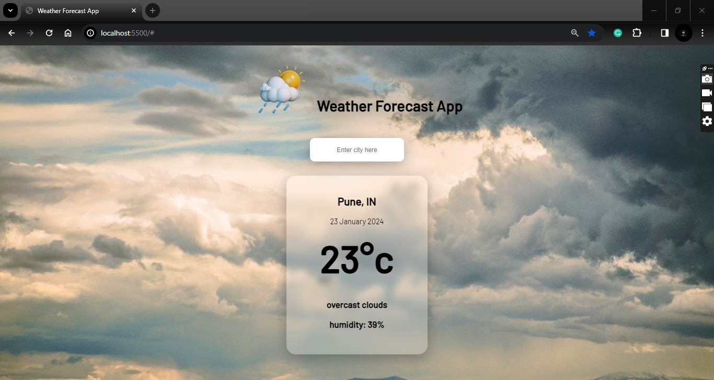

# simple-weather-forecast
simple weather forecast app using html css js


## Overview

This Weather Forecast App provides users with up-to-date weather information, helping them stay informed about current and future weather conditions.

## Features

- **Real-time Data:** Get the latest weather updates.
- **Location-based Forecast:** Provides weather details based on user's location.
- **Custom Search:** Search for weather conditions in specific locations.

## Technologies Used

- HTML, CSS, JavaScript

## Screenshots

Include screenshots of app in action.

# Home Page :


## Setup

1. Clone the repository:

    ```bash
    git clone https://github.com/your-username/weather-forecast-app.git
    ```

2. Open the project folder:

    ```bash
    cd weather-forecast-app
    ```

3. Open `index.html` in your preferred browser.


## Contributing

If you'd like to contribute to this project, follow these steps:

1. Fork the project.
2. Create a new branch.
3. Make your changes and commit them.
4. Push to your fork and submit a pull request.

## Conclusion

```plaintext
Built a user-friendly Weather Forecast App providing accurate weather info. Share feedback or ideas for improvement!
